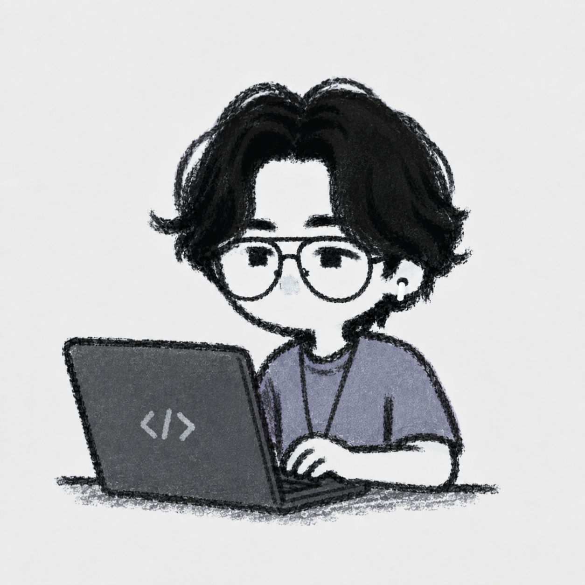

## Sobre mí
<table border="0" cellspacing="0" cellpadding="0">
  <tr>
    <td width="60%" style="border: none;">
      

        Soy desarrollador Full Stack apasionado por crear soluciones 
        eficientes y escalables. Me encanta aprender nuevas tecnologías 
        y contribuir a proyectos open source. Cuando no estoy programando, 
        probablemente estoy tomando café ☕ o jugando videojuegos 🎮.
      

    </td>
    <td width="40%" valign="middle" style="border: none;">
      
    </td>
  </tr>
</table>

## Stack de tecnologías

          
          
